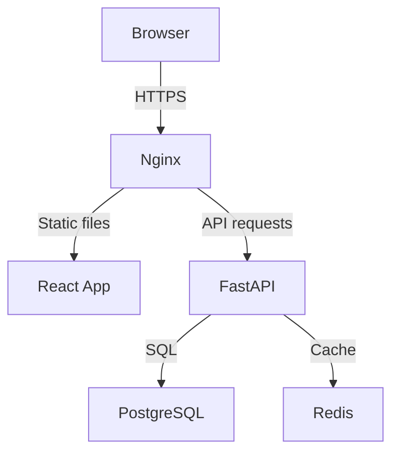

# Lesson 02: 設計ドキュメントの書き方

## このレッスンで学ぶこと

- 設計ドキュメント(Design Doc)とは何か、なぜ必要か
- Google・Amazon などが実際に使う Design Doc の構造
- システムアーキテクチャ図の描き方
- API 設計(エンドポイント定義)の書き方
- データベーススキーマ設計の書き方
- 英語での Design Doc 執筆に使えるフレーズ集

---

## 1. 設計ドキュメントとは何か

設計ドキュメント(Design Document / Design Doc)は、「どう作るか」を文書化したものです。要件定義書が「何を作るか」であるのに対し、Design Doc は「どのような構造で実現するか」を記述します。

### なぜ書くのか

**理由 1: 設計の欠陥をコードを書く前に発見できる**

コードを書いてから設計ミスに気づくと、大幅な書き直しが発生します。文書化することで「この設計には穴がある」と事前に気づけます。

**理由 2: チームの合意形成ができる**

複数人で開発するとき、各自が「こういう設計のはずだ」と異なる理解を持って実装すると、統合時に矛盾が生じます。Design Doc に書いて合意することで防げます。

**理由 3: 意思決定の記録が残る**

「なぜこの技術を選んだか」「なぜこのアーキテクチャにしたか」という判断の理由が残ります。数週間後に「なぜこうなっているのか」と自分で疑問を持ったときに役立ちます。

**理由 4: 採用で評価される**

Design Doc を書けることは、上級エンジニアとしての素養を示します。ポートフォリオに含めると採用担当者の目を引きます。

---

## 2. Design Doc のテンプレート

以下は Google 等の Tech 企業で広く使われる構造を簡略化したものです。キャップストーンプロジェクトでこのテンプレートを使用します。

```markdown
# Design Doc: [プロジェクト名]

**Author:** [氏名]
**Created:** YYYY-MM-DD
**Last Updated:** YYYY-MM-DD
**Status:** Draft / In Review / Approved

---

## Summary (概要)

[何を作るか、なぜ作るか、を 3〜5 文で。このセクションだけ読めば全体が分かるように書く]

## Background (背景)

[この設計が必要になった経緯と解決する課題。要件定義書の要約でもよい]

## Goals (目標)

- Goal 1: [達成したいこと]
- Goal 2: [達成したいこと]

## Non-Goals (スコープ外)

- [今回の設計では対応しないこと]
- [将来対応するかもしれないが今回は対象外のもの]

## Architecture Overview (アーキテクチャ概要)

[システム全体の構成図を記載。テキストベースの ASCII アートでもよい]

## Detailed Design (詳細設計)

### API Design (API 設計)

[エンドポイント一覧、リクエスト/レスポンスのフォーマット]

### Database Schema (データベーススキーマ)

[テーブル定義、リレーション]

### Frontend Architecture (フロントエンド構成)

[コンポーネント構成、状態管理方針]

## Security Considerations (セキュリティ考慮事項)

[認証・認可、入力バリデーション、機密情報の扱い等]

## Performance Considerations (パフォーマンス考慮事項)

[ボトルネックの予測と対策]

## Testing Strategy (テスト戦略)

[単体テスト、統合テスト、E2E テストの方針]

## Deployment Plan (デプロイ計画)

[本番環境の構成、CI/CD フロー]

## Open Questions (未解決の問題)

- [ ] [まだ決まっていないこと・調査が必要なこと]

## Alternatives Considered (検討した代替案)

[採用しなかった設計案と、採用しなかった理由]
```

---

## 3. アーキテクチャ図の描き方

### テキストベースの図(ASCII アート)

手軽に書けてバージョン管理に向いています。

```
[ ユーザー(ブラウザ) ]
        |
        | HTTPS
        v
[ Nginx (リバースプロキシ) ]
        |
    +---+---+
    |       |
    v       v
[ React  ] [ FastAPI ]
(静的ファイル)    |
              | SQL
              v
         [ PostgreSQL ]
```

### Mermaid 記法(GitHub で自動レンダリングされる)

Mermaid(マーメイド)は GitHub の Markdown でそのままレンダリングされる図記述言語です。

````markdown

````

---

## 4. API 設計の書き方

API(Application Programming Interface)の設計では、エンドポイント(Endpoint / URL のパス)、HTTPメソッド、リクエスト/レスポンスのデータ構造を明記します。

### RESTful API 設計の原則

| 操作 | HTTP メソッド | URL の例 |
|------|--------------|---------|
| 一覧取得 | GET | /api/v1/links |
| 詳細取得 | GET | /api/v1/links/{id} |
| 作成 | POST | /api/v1/links |
| 更新 | PUT / PATCH | /api/v1/links/{id} |
| 削除 | DELETE | /api/v1/links/{id} |

### API 仕様の書き方例

```markdown
### POST /api/v1/links

**説明:** 新しいリンクを保存する

**認証:** 必要(Bearer トークン)

**リクエストボディ:**
```json
{
  "url": "https://example.com/article",
  "memo": "参考になった記事",
  "tags": ["react", "hooks"]
}
```

**レスポンス (201 Created):**
```json
{
  "id": "550e8400-e29b-41d4-a716-446655440000",
  "url": "https://example.com/article",
  "title": "React Hooks の使い方",
  "memo": "参考になった記事",
  "tags": ["react", "hooks"],
  "created_at": "2026-07-05T10:00:00Z"
}
```

**エラーレスポンス (422 Unprocessable Entity):**
```json
{
  "detail": [
    {
      "loc": ["body", "url"],
      "msg": "invalid or missing URL scheme",
      "type": "value_error.url.scheme"
    }
  ]
}
```
```

### バージョニング(Versioning)

URL に `/v1/` を含める理由は、将来 API を破壊的変更(Breaking Change)するとき `/v2/` を追加して古いクライアントとの互換性を保てるためです。最初から付けておくことを推奨します。

---

## 5. データベーススキーマ設計の書き方

### ER 図(Entity-Relationship Diagram)

テーブルとリレーションを図示します。

```
users
+----+-------------------+----------------------------+
| id | email             | hashed_password            |
+----+-------------------+----------------------------+
| PK | UNIQUE, NOT NULL  | NOT NULL                   |
+----+-------------------+----------------------------+

links
+----+---------+---------------------+------+------------+
| id | user_id | url                 | memo | created_at |
+----+---------+---------------------+------+------------+
| PK | FK→users| NOT NULL            |      | NOT NULL   |
+----+---------+---------------------+------+------------+

tags
+----+---------+------+
| id | user_id | name |
+----+---------+------+
| PK | FK→users| NOT NULL |
+----+---------+------+

link_tags (中間テーブル)
+---------+--------+
| link_id | tag_id |
+---------+--------+
| FK→links| FK→tags|
+---------+--------+
```

### DDL(Data Definition Language)での記述

設計ドキュメントに SQL の DDL を含めると、レビュアーが直接実行して確認できます。

```sql
CREATE TABLE users (
    id          UUID PRIMARY KEY DEFAULT gen_random_uuid(),
    email       VARCHAR(255) UNIQUE NOT NULL,
    hashed_password VARCHAR(255) NOT NULL,
    created_at  TIMESTAMP WITH TIME ZONE DEFAULT NOW(),
    updated_at  TIMESTAMP WITH TIME ZONE DEFAULT NOW()
);

CREATE TABLE links (
    id          UUID PRIMARY KEY DEFAULT gen_random_uuid(),
    user_id     UUID NOT NULL REFERENCES users(id) ON DELETE CASCADE,
    url         TEXT NOT NULL,
    title       VARCHAR(500),
    memo        TEXT,
    created_at  TIMESTAMP WITH TIME ZONE DEFAULT NOW()
);

CREATE TABLE tags (
    id          UUID PRIMARY KEY DEFAULT gen_random_uuid(),
    user_id     UUID NOT NULL REFERENCES users(id) ON DELETE CASCADE,
    name        VARCHAR(100) NOT NULL,
    UNIQUE(user_id, name)
);

CREATE TABLE link_tags (
    link_id     UUID NOT NULL REFERENCES links(id) ON DELETE CASCADE,
    tag_id      UUID NOT NULL REFERENCES tags(id) ON DELETE CASCADE,
    PRIMARY KEY (link_id, tag_id)
);
```

### 設計判断を記録する

なぜ UUID を使うか、なぜ `ON DELETE CASCADE` にするかなど、判断の理由をコメントとして残します。

```sql
-- id に UUID を使う理由:
-- 連番 (SERIAL) だと外部から件数が推測されるセキュリティリスクがある。
-- また、将来的に複数のサービス間でデータをマージする際に衝突しない。
```

---

## 6. 英語での Design Doc 執筆フレーズ集

Design Doc を英語で書く(または英語レビューを受ける)際に使えるフレーズです。

### 目的・背景の記述

| 日本語 | 英語フレーズ |
|--------|-------------|
| このドキュメントの目的は〜を説明することです | The purpose of this document is to describe ... |
| 現在の問題点は〜です | The current problem is that ... |
| この設計は〜を解決することを目指します | This design aims to address ... |
| 背景として、〜 | For context, ... |

### 設計判断の説明

| 日本語 | 英語フレーズ |
|--------|-------------|
| 〜を選んだ理由は〜です | We chose ... because ... |
| 〜という代替案も検討しましたが | We also considered ..., but ... |
| 主なトレードオフは〜 | The main trade-off here is ... |
| この判断の前提は〜 | This decision assumes that ... |

### Open Questions の記述

| 日本語 | 英語フレーズ |
|--------|-------------|
| 〜はまだ決まっていません | ... is yet to be decided. |
| 〜について調査が必要です | We need to investigate ... |
| 〜に関してフィードバックをください | Please provide feedback on ... |

---

## 7. Design Doc レビューの受け方

Design Doc は書いたら必ずレビューを受けます。レビュアーへの依頼時のポイントは以下です。

- 「これで実装を始めます。問題点があれば 3 日以内に指摘してください」と期限を明示する
- 「特に〇〇のセクションについて意見が欲しい」と重点箇所を伝える
- 受けたコメントには必ず「対応した/対応しない理由」を返信する

---

## 実践演習

### 演習 1: Design Doc を書く

Lesson 01 で作成した要件定義書を元に、Design Doc テンプレートを使って設計ドキュメントを作成してください。最低限以下のセクションを埋めます。

- Summary
- Architecture Overview(図を含む)
- API Design(主要エンドポイント 5 つ以上)
- Database Schema(テーブル定義 SQL)

### 演習 2: 代替案の比較

自分が選んだ技術スタックについて、「Alternatives Considered」を書いてください。

例: 「バックエンドに FastAPI を選んだが、Express.js も検討した。FastAPI を選んだ理由は型安全性と自動 API ドキュメント生成である。」

---

## 💡 コラム: Amazon の会議はパワポ禁止・最初の15分は沈黙

Amazon の社内会議には有名なルールがあります。**パワーポイント禁止。** 提案者は最大6ページの文章(ナラティブ)を書き、会議の冒頭15分、出席者全員が**沈黙してそれを読む**ことから始まります。

創業者ジェフ・ベゾスの説明はこうです — 「**箇条書きは考えの粗さを隠せるが、文章は隠せない。**」スライドの箇条書きは「・性能を改善する」と書けば済みますが、文章では「何の性能を、なぜ、どうやって、どんなトレードオフを受け入れて改善するのか」を書かざるを得ない。書けない部分こそが、まだ考えていない部分なのです。

これは設計文書(Design Doc)の本質を突いています。**設計文書の最大の受益者は、読者ではなく書いている本人**です。書く前は「全部考えた」と思っていても、文章にすると穴が見える。コードを書き始める前に文章で穴を見つけるのは、建築前に図面で欠陥を見つけるのと同じで、圧倒的に安上がりです。あなたのキャップストーンで設計文書を書くのは、この「安い失敗」を先に済ませるためです。

---

## まとめ

- Design Doc は「どう作るか」を記録する文書。実装前に書く
- アーキテクチャ図、API 設計、DB スキーマの 3 つが核心
- 設計判断の「理由」を必ず記録する。未来の自分へのメモでもある
- 英語で書けると、OSS 貢献や国際的なチームで大きな強みになる

次のレッスンでは、キャップストーンプロジェクトの全体像を把握します。

## 確認問題

1. Design Docを実装前に書くことで、どのような手戻りを減らせますか？
2. アーキテクチャ図、API設計、DBスキーマはそれぞれ何を伝えますか？
3. 設計判断に選択肢だけでなく理由と捨てた案を書くべきなのはなぜですか？
4. Open Questionsを残すことと、設計を未完成のまま放置することの違いは何ですか？
5. 第三者がDesign Docをレビューするとき、最低限確認すべき項目を3つ挙げてください。
